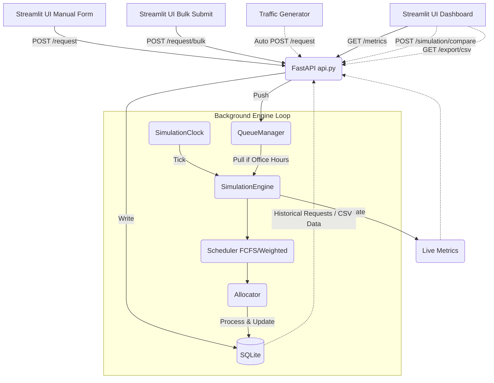

# Thesis Simulation Refactoring: Continuous API-Driven System

This document outlines the architectural changes, data flow, and step-by-step migration plan to refactor the batch simulation into a continuous, real-time API-driven system.

## User Review Required

> [!IMPORTANT]
> - **Simulation Time Advancement**: In continuous simulations, the "clock" needs a tick rate. For example, 1 real second = 1 simulation minute. I will implement a configurable tick rate. Let me know if you have a preferred default.
> - **Frontend Communication**: Streamlit runs synchronously. To get "live" metrics, Streamlit will need to poll the new FastAPI backend (e.g., using `st_autorefresh` or simple polling loops). 
> - **Database ORM**: I plan to use SQLAlchemy with SQLite to persist requests and metrics.
> - **Comparing Variants**: Since requests arrive continuously over an API, we will support comparing variants by replaying the exact historical requests from the database in a "fast-forward" batch mode after the live simulation ends.

## Preserving Existing Features & Manual Mode

None of your existing features will be removed! Here is how they translate to the new architecture:

1. **Presets**: The Preset system (saving and loading UI settings) is purely a frontend feature. It will remain exactly as it is. Loading a preset will simply update the Streamlit UI, which will then send those exact configurations to the API when you hit "Run".
2. **Seed (Manual/Auto)**: The random seed will still be sent to the backend. It will be used by the Simulation Engine to ensure that any random elements (like processing duration variations) remain deterministic and reproducible.
3. **Automated Traffic Generator (Optional)**: We will add a toggle in the UI. If enabled, the backend will spawn a script that pre-calculates a schedule of requests and automatically fires them at exactly the right simulated times.
4. **Manual Request Submission**: Because the core engine is now an API, you can submit requests manually at any time! We will add a new "Submit Request" form in your Streamlit UI where you can manually select a Student ID, College, Document Type, and Urgency, and hit submit. This will immediately push the request to the live API queue.
5. **Concurrent Submissions Demonstration**: To demonstrate what happens when multiple users submit requests at the exact same time, we will add a "Bulk Submit" or "Concurrent Submit" tool in the UI. This will let you instantly fire a batch of 2-5 distinct requests to the API with the exact same simulated timestamp. 

## High-Impact Thesis Defense Features (NEW!)

Given the strict deadline, we should avoid over-engineering (e.g., avoid WebSockets, use simple HTTP polling). However, the following features are easy to implement and will impress a thesis panel:
- **System Recovery Demonstration**: Because we use SQLite, we can intentionally kill the FastAPI server mid-simulation. When we restart it, the engine will read pending requests from the database and resume processing automatically. This demonstrates robust architecture.
- **CSV Data Export**: We will add a `GET /export/csv` endpoint and a "Download Results" button in the UI. This will dump all processed requests, timestamps, and staff assignments into a clean CSV file so you can easily generate graphs for your thesis paper and defense slides.

## Proposed Architecture

We will separate the system into a decoupled frontend and backend. The backend will run a FastAPI server and a background worker thread/task for the continuous simulation engine.

### Directory Structure

```text
backend2/
├── config.py             # Existing
├── rules.py              # Existing
├── models.py             # Modified (Add SQLAlchemy mapping)
├── engine.py             # Modified (Continuous loop & Historical Replay)
├── api.py                # [NEW] FastAPI application & endpoints
├── queue_manager.py      # [NEW] Thread-safe request queue
├── database.py           # [NEW] SQLite/SQLAlchemy setup
├── simulation_clock.py   # [NEW] Time management and office hours
├── traffic_generator.py  # [NEW] Auto-submits requests to API over time (Optional)
```

### Components

#### 1. `simulation_clock.py`
Manages the simulation's current time independently of real-world time.
- `current_time`: The simulated datetime.
- `tick(delta_minutes)`: Advances the clock.
- `is_office_hours()`: Returns True if between 8:00 AM and 5:00 PM.
- `is_working_day()`: Checks for weekends/holidays.

#### 2. `queue_manager.py`
A thread-safe buffer (`asyncio.Queue` or `queue.Queue`) between the FastAPI endpoints (which receive requests) and the Simulation Engine (which processes them). 

#### 3. `database.py` & Persistence
Uses SQLite (`requests.db`).
- Table `requests`: Stores incoming payloads (`student_id`, `document_type`, `college`, `urgency`, `status`, `submission_time`, `completion_time`).
- Allows the system to resume processing pending requests after a restart.
- **Historical Record**: Keeps a record of all submitted requests so they can be replayed to compare different schedulers/allocators.

#### 4. `api.py` (FastAPI)
- `POST /request`: Receives new requests, validates them, saves to DB, and pushes to `queue_manager`.
- `POST /request/bulk`: Receives multiple requests at once and assigns them the exact same timestamp.
- `GET /metrics`: Returns live waiting time, turnaround time, throughput, queue length, and staff utilization.
- `POST /simulation/start`: Starts the continuous engine loop and optionally starts the `traffic_generator`.
- `POST /simulation/pause`: Pauses the clock and engine.
- `POST /simulation/reset`: Clears the queue and resets the clock/metrics.
- `POST /simulation/compare`: Runs a fast-forward batch simulation over historical requests.
- `GET /export/csv`: **[NEW]** Downloads the database as a CSV file for analysis.

#### 5. `traffic_generator.py` (Automated Traffic)
Uses your existing `_generate_requests` logic to spread requests between 8 AM and 5 PM on specific dates.

#### 6. `engine.py` (Continuous Loop & Replay)
Instead of processing a pre-generated batch, the engine runs a continuous loop (e.g., ticking every second):
1. Tick the simulation clock.
2. Check `is_office_hours()`.
3. If true, pull all available requests from `queue_manager` and add them to the `FCFS` or `Weighted` scheduler.
4. Process schedulers and allocators exactly as before.
5. Update metrics.

## Data Flow Diagram



## Step-by-Step Migration Plan

### Phase 1: Foundation (Database & Clock)
1. Implement `database.py` with SQLAlchemy models.
2. Implement `simulation_clock.py` with `is_office_hours` logic.
3. Implement `queue_manager.py` for thread-safe memory handling.

### Phase 2: Engine Refactoring
1. Modify `engine.py`. Move `_generate_requests` to a separate `traffic_generator.py` script.
2. Introduce a `run_continuous()` method that loops, ticks the clock, and polls the queue.
3. Introduce a `run_replay(requests, scheduler, allocator)` method for comparing variants.
4. Keep the core logic of `_run_fcfs` and `_run_weighted`, but adapt them to process one "tick" at a time rather than a whole batch loop.

### Phase 3: API Layer & Traffic Generation
1. Build `api.py` using FastAPI.
2. Add the `/request`, `/request/bulk`, and `/export/csv` endpoints.
3. Add endpoints for simulation control (`start`, `pause`, `reset`, `compare`) and `/metrics`.
4. Connect the `traffic_generator` so it starts firing requests in the background when `POST /simulation/start` is hit.

### Phase 4: Streamlit Integration
1. Update `frontend2/` to remove direct imports of `SimulationEngine`.
2. Replace local execution with HTTP calls to the FastAPI backend using the `requests` library.
3. Add a live dashboard that polls `/metrics` every few seconds to show queue length, active staff, and processed requests.
4. Build a "Submit Request" manual form and a "Bulk Submit" tool directly in Streamlit to trigger `POST /request` and `POST /request/bulk`.
5. Update `run_variant_for_figure` to call the new `/simulation/compare` API endpoint.

## Recommended Implementation Order
I recommend proceeding in the exact order of the **Step-by-Step Migration Plan** above. 
Please review this plan. If you approve, I will begin implementing Phase 1 and Phase 2.
